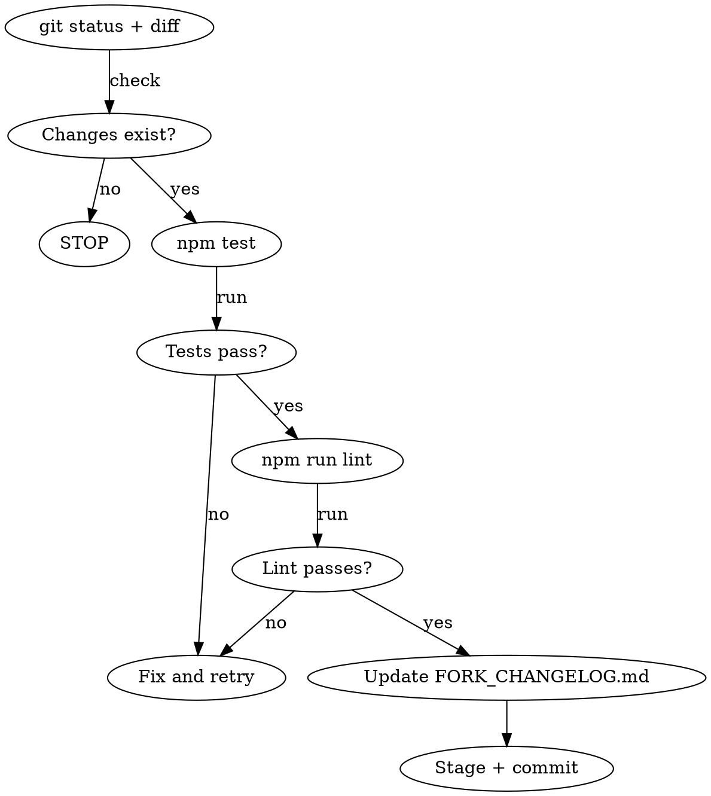

# Commit Changes

Commit workflow for this project. Runs checks, updates the fork changelog, and creates a conventional commit.

## Workflow



## Steps

### 1. Review changes

Run `git status` and `git diff` (staged + unstaged) to understand what's being committed. If there are no changes, tell the user and stop.

### 2. Run tests

```bash
npm test
```

If tests fail, fix the failures before continuing. Do NOT skip tests.

### 3. Run lint

```bash
npm run lint
```

If lint fails, fix the issues before continuing. Do NOT skip lint.

### 4. Update FORK_CHANGELOG.md

**Every commit MUST include a FORK_CHANGELOG.md update.** This is a project requirement.

- Read the current `FORK_CHANGELOG.md` to see the format and existing entries
- Add a new bullet under today's date heading (`## YYYY-MM-DD`)
- If today's date heading already exists, append to it
- If it doesn't exist, add it at the top (below the `# Fork Changelog` title and description)
- Each entry: `- **Short title**: Description of what changed and why`
- Be specific — mention files, modules, or features affected

### 5. Stage and commit

- Stage specific files by name (not `git add -A` or `git add .`)
- Never commit `.env`, credentials, or secrets
- Write a conventional commit message matching the project style:
  - `feat:` for new features
  - `fix:` for bug fixes
  - `refactor:` for restructuring
  - `docs:` for documentation only
  - `style:` for formatting only
  - `test:` for test changes only
  - `chore:` for maintenance
- Use a HEREDOC for the commit message
- Check `git log --oneline -5` first to match the tone of recent messages

## Rules

- Do NOT use `--no-verify` — the pre-commit hook (prettier) must run
- Do NOT amend previous commits unless explicitly asked
- Do NOT push unless explicitly asked
- If the pre-commit hook fails, fix the issue and create a NEW commit
- If the user says "commit" without specifying files, commit all current changes
